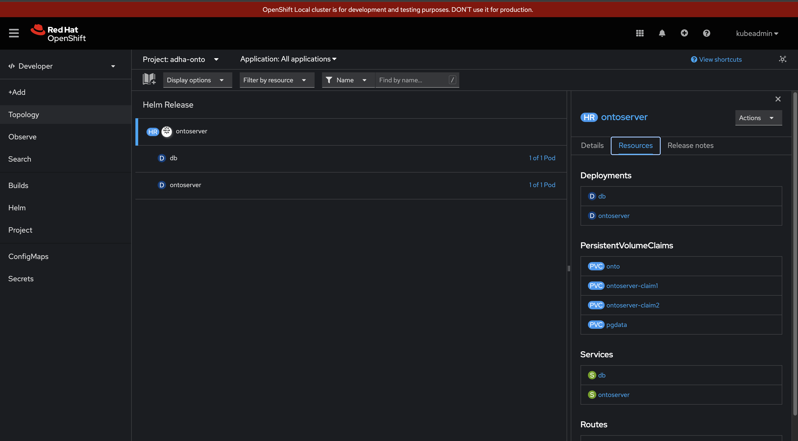
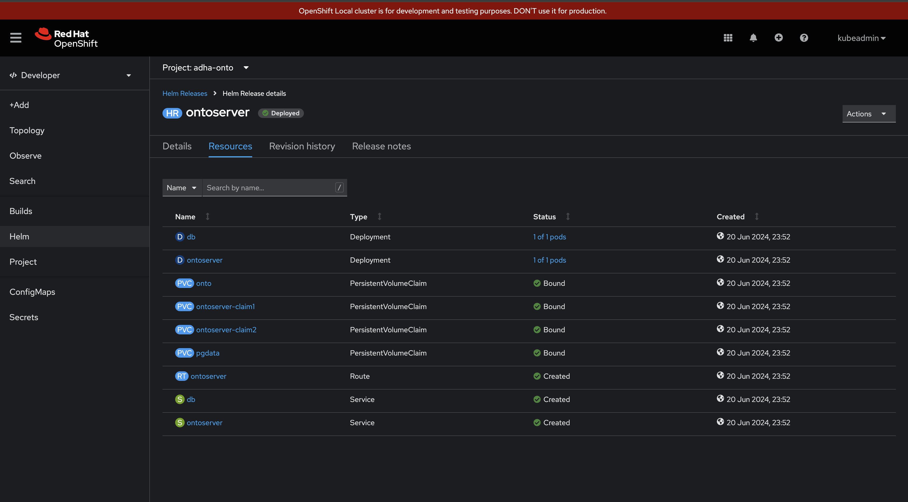
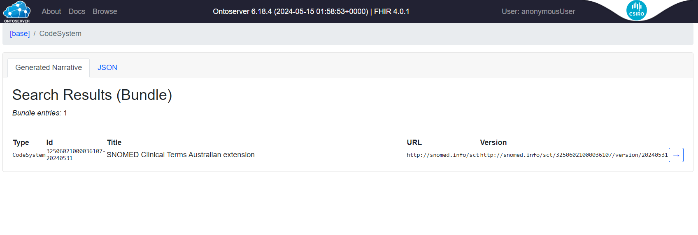

# Use Helm to deploy OntoServer

Artifacts to deploy ontoserver to OpenShift using Helm charts.

## Steps to deploy OntoServer

* Switch to the helm folder

```bash
$ cd ./ontoserver-openshift/helm/ontoserver
```

* Create a new OpenShift project:

```bash
$ oc new-project ontoserver
Now using project "ontoserver" on server "https://api.crc.testing:6443".

You can add applications to this project with the 'new-app' command. For example, try:

    oc new-app rails-postgresql-example

to build a new example application in Ruby. Or use kubectl to deploy a simple Kubernetes application:

    kubectl create deployment hello-node --image=registry.k8s.io/e2e-test-images/agnhost:2.43 -- /agnhost serve-hostname
```

* Create a registry secret for the CSIRO quay login:

```bash
# Command will create the auth file for the first time.
$ podman login --authfile=auth.json  quay.io
username: user
password: 

Login Succeeded!
```

* Create the secret in OpenShift to access the registry

```bash
$ oc create secret generic regcred --from-file=.dockerconfigjson=auth.json --type=kubernetes.io/dockerconfigjson
```

* Link the registry secret to the `default` service account:

```bash
$ oc secrets link default regcred --for=pull
```

* Install the `ontoserver` instance using Helm:

```bash
# --wait is optional. It is useful if the command is part of an automation
# --timeout should be used with --wait parameter. Default value is 5m0s

$ helm install ontoserver . --values values.yaml --wait --timeout=2m30s

NAME: ontoserver
LAST DEPLOYED: Wed Jun  5 10:43:55 2024
NAMESPACE: ontoserver
STATUS: deployed
REVISION: 1
TEST SUITE: None
```




* You can now list out the pods / routes created, and access the ontoserver instance.

```
$ oc get pods,svc,routes,deploy -n ontoserver

NAME                             READY   STATUS    RESTARTS   AGE
pod/db-558754d7c9-cvf7g          1/1     Running   0          14s
pod/ontoserver-87d5d89f7-zjlh4   1/1     Running   0          14s

NAME                 TYPE        CLUSTER-IP      EXTERNAL-IP   PORT(S)    AGE
service/db           ClusterIP   172.30.45.179   <none>        5432/TCP   14s
service/ontoserver   ClusterIP   172.30.108.81   <none>        8080/TCP   14s

NAME                                  HOST/PORT                                                    PATH   SERVICES     PORT   TERMINATION   WILDCARD
route.route.openshift.io/ontoserver   ontoserver-ontoserver.apps.cluster1.sandbox2237.opentlc.com          ontoserver   8080   edge          None

NAME                         READY   UP-TO-DATE   AVAILABLE   AGE
deployment.apps/db           1/1     1            1           14s
deployment.apps/ontoserver   1/1     1            1           14s
```
### Optional: Load Data
* To load data you can access the terminal for the `onto` server and use the `index.sh` script:

```bash
$ oc get pods -n ontoserver
pod/db-fb6955967-n5pfd            1/1     Running   1          18h
pod/ontoserver-7d9f8974d7-58zjs   1/1     Running   1          18h

$ oc rsh pod/ontoserver-7d9f8974d7-58zjs
~ $ /index.sh
```
### Testing the application

Finally, you can navigate to the [https://ontoserver-ontoserver.apps-crc.testing/fhir/CodeSystem](https://ontoserver-ontoserver.apps-crc.testing/fhir/CodeSystem) URL and verify that the application is up:

```bash
$ firefox https://$(oc get route -n ontoserver -ojson | jq '.items[].spec.host')/fhir/CodeSystem
```


